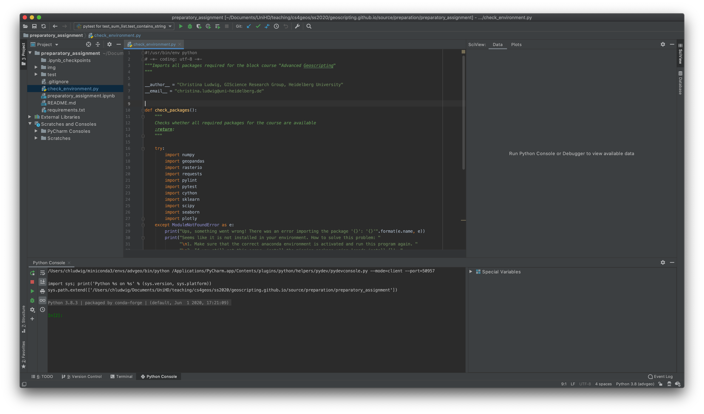
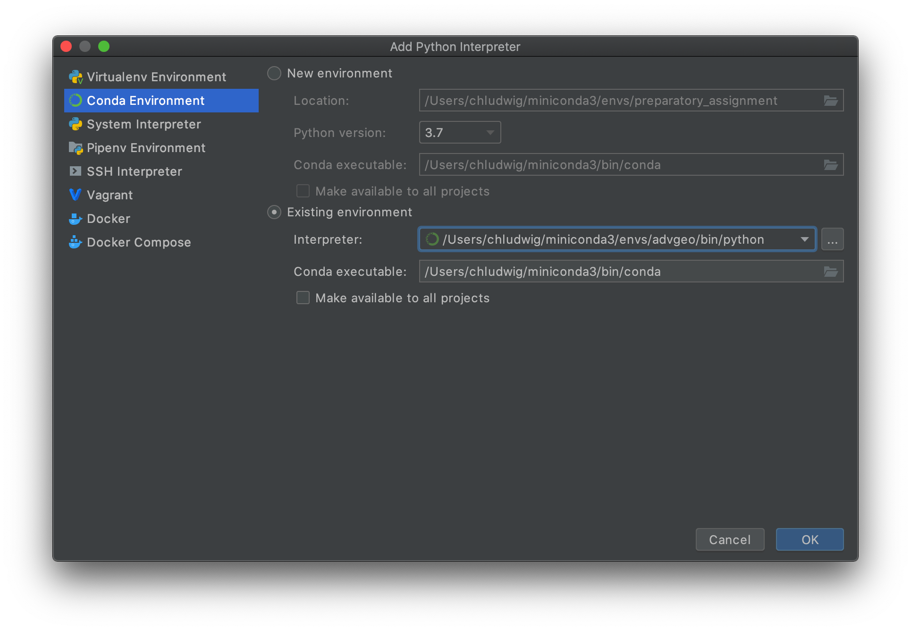

# Advanced Geoscripting: Software Setup

This document describes how to install all required software for the course. Please make sure that all software is installed and working on your computer.

## 1. Python

Download and install [Anaconda](https://www.anaconda.com/products/individual), a package manager for Python. (You may also use virtualenv or the like if you prefer, but I recommend using Anaconda.)

### 1.2 Set up Python environment

open the Anaconda prompt and execute the commands below to set up a new environment called *advgeo*

**1. Create a new virtual Python environment.**

```
$ conda create -n advgeo python=3
```

**2. Install all required Python packages** listed in the file `requirements.txt`. Remember to activate your environment before installing the packages.

```
$ conda activate advgeo
$ conda install --file requirements.txt
```

### 1.3 Python IDEs

An IDE (Integrated Development Environments) is basically a text editor with a lot of additional functionalities (e.g. syntax highlighting, automated code completion) which makes writing code easier and faster. During this course we will use PyCharm and Jupyter Notebooks.

#### PyCharm

I recommend applying for a `free student license <https://www.jetbrains.com/community/education/#students>`_, which let's you use the PyCharm Professional Edition for free. Compared to the PyCharm Community Edition (which is free for everyone), the Professional Edition provides a few more useful tools for scientific programming. (e.g. viewing plots)



**Configure Python Environment in PyCharm**

1. Open PyCharm and create a new, empty project or open an existing one.
2. Open the project preferences.
3. Choose the *advgeo* environment as the Project Interpreter.


The new environment is probably not shown in the list of available environments within Pycharm. In this case, click on the button marked in the image above and choose "Add". The following window should appear. Select the new anaconda environment and click "OK".



Make sure that you set the new environment also for the Python console within PyCharm.


#### Jupyter Notebook

During the course we will be working with Jupyter Notebooks. In a nutshell, a Jupyter notebook is a combination of a web application and a python script. In this way, it can display Python code alongside formatted text, figures and charts. Notebooks are used frequently within scientific computing, because it is great way of explaining what the script is doing. Watch [this video](https://www.youtube.com/watch?v=jZ952vChhuI) for a brief introduction to jupyter notebook. 

**Verify installation**

We've already installed jupyter notebook using conda above. To check wether it works, start a new jupyter notebook server by executing the following command within the Anaconda prompt and inside your advgeo environment.

```
$ conda activate advgeo
$ jupyter notebook
```

A new browser window will open. If you started the jupyter server from within the folder of the preparatory assignment, then it will look like this.


If you get a ``command not found`` message, make sure that the correct Python environment is activated.
To create a new jupyter notebook, click on the drop down menu *New* (top right) and create a new Jupyter Notebook by clicking on *Python 3*.


### git: version control system

git is a version control system which lets you track the changes you or others have made to the files of your project. If you are on Mac OS or Linux, git should already be preinstalled.

#### git for Windows

If you are on Windows, install [git for Windows](https://git-scm.com/download/win). Please follow this [video tutorial](https://www.youtube.com/watch?v=339AEqk9c-8) in order to choose the right settings during installation.
